<h3><code>rahul@github ~ $ ./contributions.sh</code></h3>

  

<h3><code>rahul@github ~ $ whoami</code></h3>

<table>
<tr>
<td valign="top"></td>
<td valign="top"></td>
</tr>
</table>

 

Self-hosted SVG profile art · No stats service · No token · Refreshed daily with GitHub Actions

---

### `rahul@github ~ $ ls ~/projects`

- **[IIT_CHICAGO_Internship_project](https://github.com/rahulkumar123-123/IIT_CHICAGO_Internship_project)** — bioinformatics + ML research.
- **[Parkinson-s-speech-detection-](https://github.com/rahulkumar123-123/Parkinson-s-speech-detection-)** — speech-based Parkinson's detection using Wav2Vec2/WavLM and deep learning.
- **[cardmaxxing](https://github.com/rahulkumar123-123/cardmaxxing)** — India-specific credit-card recommendation platform.
- **[customer-churn-analytics](https://github.com/rahulkumar123-123/customer-churn-analytics)** — customer churn analytics and prediction.

### `rahul@github ~ $ cat stack.txt`

`Python` · `C++` · `SQL` · `JavaScript` · `React` · `Node.js` · `MongoDB` · `Power BI` · `Machine Learning` · `Data Analysis`

### `rahul@github ~ $ git status`

`4th-year ECE student @ BIT Mesra` · `ML / GenAI / Data Science` · `Research + Software`

